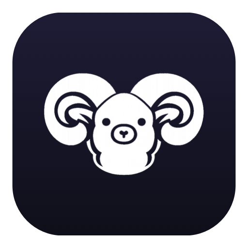
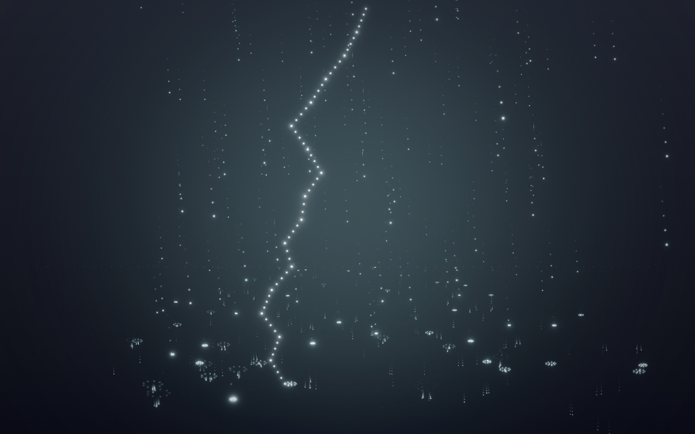
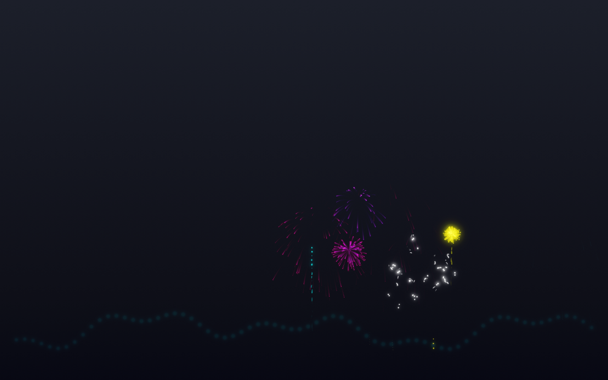
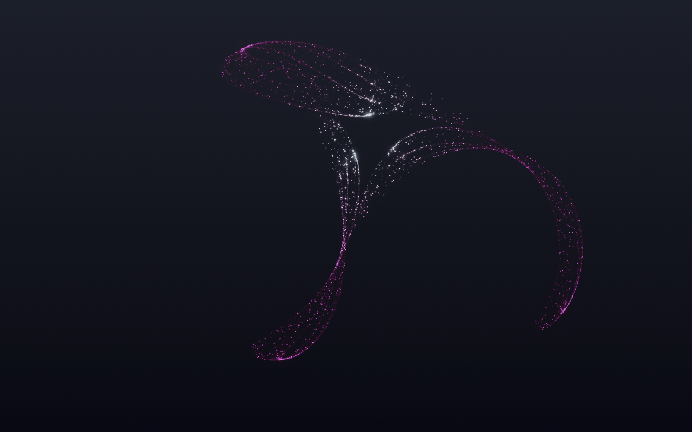
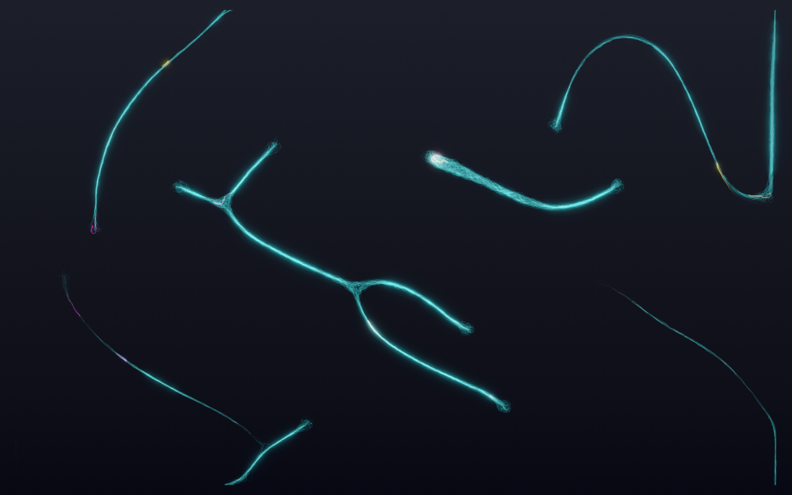
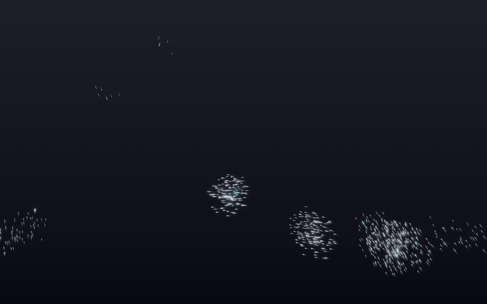
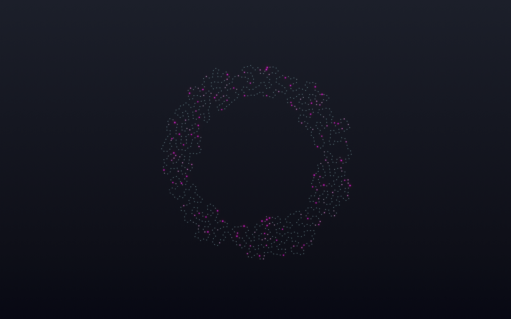

<p align="center">
  
</p>

<h1 align="center">RAMble</h1>

<p align="center"><strong>Watch your Mac think.</strong></p>

<p align="center">
  <a href="https://github.com/jangles-byte/RAMble/releases/latest"></a>
  
  
  
</p>

<p align="center">
  
  <br><em>Live on a real desktop: Murmuration in a full storm while Ollama pins the GPU.
  <a href="assets/demo.mp4">Watch the full one-minute demo (MP4)</a>.</em>
</p>

RAMble is a free, native macOS overlay that turns your system's inner life —
RAM pressure, CPU, GPU, swap, and your local LLMs — into living, glowing
animations on your desktop. When Ollama streams tokens, you *see* a neural
network firing. When memory pressure climbs, you *see* the machine strain. No
graphs, no numbers — you just know, at a glance, like watching weather.

It sits behind your windows (or in front, your call), never catches a click,
and idles light enough to leave on all day.

- **Native** — Swift + Metal, universal (Apple Silicon + Intel). No Electron, no browser, no ports.
- **Private** — reads public system counters and localhost only. Nothing
  leaves your machine, no analytics, no accounts.
- **Open** — MIT-spirited source, plugin SDK, ~zero dependencies.

---

## The animations

| | |
|---|---|
| **Synapse** | A neural artery crosses your screen through a living canopy of dendrites, silver at rest — color exists only while the machine computes. Every token your model generates enters at the left as a comet-tailed pulse and crosses the whole trunk, shedding cascades at each hub. This is what "the model is thinking" looks like. |
| **Rain** | A storm on a receding ground plane. Drops land big and bright at the front, small and dim toward the horizon, each throwing a splash crown and ripple. Load drives the downpour, wind slants it, and lightning strikes as the gauges climb. |
| **Filigree** | A strange attractor as the shape of the machine's mind: one chaotic filament sculpture, deposited from thousands of faint points, that kneads itself faster the harder the system works. Tokens burn hot through the lace; loading a model re-forms it into a new sculpture. |
| **Murmuration** | Hundreds of silver birds wheel as one organism. RAM grows the flock, stress frays it into nervous scatter, and each generated token ignites a colored leader streaking through. Hit swap and a red predator appears and hunts the flock open. |
| **Mycelium** | A slime-mould colony forages your screen: thousands of blind agents grow living transport filaments, junction by junction. CPU speeds the foraging, stress starves the network thin, tokens feed it bursts of color, and loading a model re-seeds the organism. |
| **Coral** | Computation as accretion. A closed ring grows by insertion into ruffled, brain-fold reefs — the shape on screen is the fossil record of your machine's work. The growing edge glows young, sustained load blooms folds on folds, and a model load wipes the reef like a tide. |
| **Fireworks** | A night valley behind an invisible treeline. Calm gets one low lazy shell every little while; load raises the launch rate, the apex, and the burst size until sustained effort tips into a grand finale of stacked volleys. Every falling ember dies into the silhouette. |

<table>
  <tr>
    <td width="50%"><br><em>Rain — lightning cracks as the gauges climb</em></td>
    <td width="50%"><br><em>Fireworks — shells over the invisible treeline</em></td>
  </tr>
  <tr>
    <td><br><em>Filigree — the machine's mind as a chaotic sculpture</em></td>
    <td><br><em>Mycelium — living transport filaments, junction by junction</em></td>
  </tr>
  <tr>
    <td><br><em>Murmuration — the flock frays as pressure climbs</em></td>
    <td><br><em>Coral — the machine's work, accreted into folds</em></td>
  </tr>
</table>

*Every screenshot above is a real frame rendered by RAMble's own headless
`--snapshot` mode — no compositing tricks, just the actual HDR pipeline.*

**Every scene reacts to sudden change, not just steady load.** A compute
spike — a build kicking off, a model loading — lands as an *event* the
moment it happens: Rain cracks lightning and slams a gust, Synapse detonates
hubs, Murmuration startles like a gunshot in the valley, Fireworks answers
with an instant volley.

**This release is a major animation design overhaul, thanks to
[Atelier](https://github.com/jangles-byte/atelier)** — a design-skill
package for Claude Code (philosophy-first direction, verified generative
systems, and a critique loop that scores real renders). Every scene was
rebuilt or newly designed through it: Synapse from the ground up, and
Filigree, Murmuration, Mycelium, Coral, and Fireworks born from its
generative-motion systems. Each scene's design philosophy lives in
[docs/](docs/).

Seven themes (Glass, Cyberpunk, Minimal, Synthwave, Terminal, Dark, Light)
restyle everything, and an **Intensity slider** runs the whole show from
slow-drip-zen to full chaos.

## What it watches

- **Memory** — used / free / cached / wired / compressed, real memory
  pressure, and swap (usage, growth, page-ins/outs)
- **CPU** — total, per-core, efficiency vs performance cores
- **GPU** — utilization via IOKit
- **Disk** — read/write throughput
- **Local AI** — Ollama, LM Studio, llama.cpp, vLLM, Open WebUI, and any
  process you add: model loads/unloads, context length, and generation
  activity (model load = burst; tokens = firing; finish = ripple)

> Honesty note: local LLM servers don't expose live token counters, so
> tokens/sec is an intensity estimate derived from accelerator activity —
> perfect for driving visuals, not for benchmarking.

---

## Install

### Option 1 — Download (easiest)

1. Grab **`RAMble.app.zip`** from the
   [latest release](https://github.com/jangles-byte/RAMble/releases/latest).
2. Unzip it and drag **RAMble.app** into your **Applications** folder.
3. **Run this one command in Terminal — you almost certainly need it:**

   ```sh
   xattr -dr com.apple.quarantine /Applications/RAMble.app
   ```

4. Now open RAMble normally. A **welcome window** confirms it's running.

> **Why step 3?** RAMble is open-source and signed ad-hoc rather than with a
> $99/yr Apple Developer ID, so it isn't notarized. macOS quarantines
> anything downloaded from the internet, and for un-notarized apps Sequoia
> often reports **"RAMble is damaged and can't be opened"** — which is
> misleading; nothing is damaged. The command above just removes the
> quarantine flag. Right-click → Open no longer reliably bypasses this on
> macOS 15+, so use the command. Building from source (Option 2) avoids the
> issue entirely, since locally built apps are never quarantined.

After launch, look for the **ram-head icon in your menu bar** — RAMble has no
Dock icon and no window, so that icon is the whole interface. Reopen the
guide any time from **menu bar → Welcome / Help**.

Runs on Apple Silicon **and** Intel (universal binary), macOS 15+.

### Option 2 — Build from source (5 minutes, no Xcode needed)

Requirements: macOS 15+ (Apple Silicon or Intel) and the Swift toolchain from
Apple's Command Line Tools.

```sh
# 1. Get the toolchain (skip if you already have git/swift):
xcode-select --install

# 2. Clone and build:
git clone https://github.com/jangles-byte/RAMble.git
cd RAMble
./scripts/make-app.sh

# 3. Install and launch:
cp -R build/RAMble.app /Applications/
open /Applications/RAMble.app
```

Want to try it without installing? `swift run -c release` runs it in place.

---

## Using RAMble

Everything lives under the **ram-head menu bar icon** (top-right of your
screen):

- **Show Overlay** — toggle the animation on/off
- **Animation** — switch between Synapse, Rain, Filigree, Murmuration,
  Mycelium, Coral, Fireworks
- **Welcome / Help** — reopen the first-run guide
- **Settings…** — the good stuff (below)
- **Check for Updates…** — one-click update to the latest release
- **Quit RAMble**

The overlay draws **behind your windows**, on the desktop itself — hide or
move a window (or press F11) to see it. It's fully click-through: it can
never steal a click, a keystroke, or focus.

### Settings tour

**Appearance**
- **Bring to front** — float the animation *over* all your windows instead
  (still click-through). Pair with the opacity slider to keep working
  through it.
- **Intensity** — tortoise-to-hare slider. Left: sparse and calm even under
  load. Right: busy screen even at idle. System load layers on top either
  way. (Lower intensity also means less CPU spent.)
- **Opacity / Scale** — how visible, how big. Scale shrinks the scene from
  the center; physics objects can tumble out of a shrunken scene and bounce
  along your real screen edges before fading away.
- **Resolution** — internal render resolution, 100% down to an extreme 5%.
  GPU cost scales with pixel count, so 25% renders ~6% of the pixels; below
  50% the upscaling switches to crisp nearest-neighbor and the whole thing
  goes deliberately retro — "Pixel mode." Pair with the 30 FPS limit for a
  near-free overlay on battery.
- **Animation / Theme / Frame rate** — pick your look; 30 FPS roughly halves
  RAMble's cost vs 60.

**Displays** — choose which monitors show the overlay.

**Monitoring**
- **Desktop meters** — a compact, draggable panel of live bars (RAM,
  pressure, swap, CPU, GPU, disk, stress, tokens/sec). Click and hold to
  drag it anywhere; it can't be lost off-screen; picking a corner resets it.
- **Watched processes** — add your own process names (comma-separated) to
  the AI watch list.
- **Live state** — the raw numbers, if you want to peek behind the curtain.

**General** — start at login, hide/show Dock icon, version + **Check for
Updates** button.

### See it react (the fun part)

```sh
# If you use Ollama:
ollama run llama3.2 "write me a limerick about RAM"
```

Watch Synapse light up while tokens stream — bursts on model load, cascade
storms during generation, a ripple when it finishes. No LLM handy? Open a
few heavy apps or build some code and watch the stress climb.

## Updating

Menu bar icon → **Check for Updates…** → click **Update to X**. RAMble
downloads the new version, swaps itself, and relaunches. Done.

## Uninstall

Quit RAMble from the menu bar, then drag `/Applications/RAMble.app` to the
Trash. There are no background helpers; settings live in standard macOS
preferences and weigh a few KB.

## Troubleshooting

| Symptom | Fix |
|---|---|
| "I opened it and nothing happened" | That's almost the point — check the **menu bar** for the ram icon, then hide a window to see the desktop. |
| Can't see the animation | Menu bar icon → make sure **Show Overlay** is checked; Settings → Displays → your monitor is enabled; try **Bring to front** to rule out wallpaper utilities that cover the desktop layer. |
| **"RAMble is damaged and can't be opened"** | Nothing is damaged — it's the quarantine flag on an un-notarized app. Run `xattr -dr com.apple.quarantine /Applications/RAMble.app` and open it again. |
| Double-clicked it and nothing happened | RAMble has no Dock icon or window by design. Check the **menu bar** for the ram icon. If your menu bar is full (or hidden by a notch), quit some menu-bar apps or use a manager like Bartender. First launch also shows a welcome window. |
| Won't launch on an older Mac | RAMble needs **macOS 15+**. The binary is universal (Apple Silicon + Intel), but Sequoia is the floor. |
| Feels heavy | Settings → Appearance: drop **Frame rate** to 30, pull **Resolution** down (below 50% goes pleasantly retro), and/or pull **Intensity** left. Debug builds are slow — always use the release build. |
| LLM activity not detected | RAMble polls Ollama on `:11434` and OpenAI-compatible servers on `:1234`/`:8080`/`:8000`. Custom setup? Add your server's process name under Settings → Monitoring. |
| Meters panel vanished | Settings → Monitoring → pick any corner — that resets its position. |

## Performance

Release builds render up to ~32k particles through a single instanced Metal
draw with trail and bloom post-passes. Monitoring samples at 1 Hz (system)
and 2.5 Hz (processes + LLM HTTP), so the watcher itself is near-free. Your
levers: FPS limit, Intensity, and animation choice. At 30 FPS + low
intensity, RAMble fades into single-digit-idle territory; at 120 FPS +
maximum chaos, it's a light show and priced accordingly.

## For developers

- **[docs/ARCHITECTURE.md](docs/ARCHITECTURE.md)** — monitors → unified
  `SystemState` → stress engine → Metal renderer → plugins.
- **[docs/PLUGIN_SDK.md](docs/PLUGIN_SDK.md)** — write your own animation
  in ~60 lines; see [Examples/PulseRingPlugin.swift](Examples/PulseRingPlugin.swift).
- **Contributing a scene?** We strongly recommend designing it with
  [Atelier](https://github.com/jangles-byte/atelier), the design-skill
  package every current scene was built with: write the philosophy first
  (see the `docs/*-design.md` files for the format), pick a verified
  generative system, then render real frames with `--snapshot` and critique
  them before opening a PR. Scenes that ship with a philosophy doc and
  before/after renders get reviewed fastest.
- **[docs/BUILDING.md](docs/BUILDING.md)** — targets, tests, packaging.
- Verify any change with `swift run RAMbleSelfTest` (60+ checks, no Xcode
  required).

Built with Swift 6, SwiftUI, Metal, and Combine. PRs welcome.
